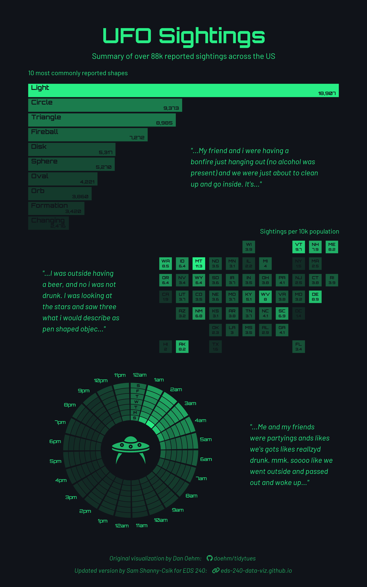

# UFO Sightings Data Visualization

## Author: Richard Montes Lemus

## Purpose

This repository contains the analysis and visualization of UFO sighting data. This assignment focuses on created custom ggplot objects for a variety of plots and then patching them together onto a base plot to create a custom plot. This custom plot represents UFO sighting frequency over time and space using a variety of visualization techniques.

## File Structure

```         
├── eds240-hw1-ufo.Rproj
├── fonts
├── HW1_files
├── HW1.html
├── HW1.pdf
├── HW1.qmd
├── images
│   └── ufo.png
├── outputs
│   └── ufo_sightings_infographic.png
└── README.md
```

## File Description

-   `HW1.qmd` - Quarto document containing code interpretation and analysis
-   `images/` - Folder containing the UFO image used for the final visualization
    -   `ufo.png` - UFO graphic
-   `fonts/` - Folder containing custom fonts
-   `outputs/` - Folder for rendered visualizations
    -   `ufo_sightings_infographic.png` - Final custom infographic
-   `README.md` - This file

## Data Access

The analysis uses two data sets from the [TidyTuesday project](https://github.com/rfordatascience/tidytuesday):

1.  **UFO Sightings Data**: Accessible via URL in the code
    -   `https://raw.githubusercontent.com/rfordatascience/tidytuesday/main/data/2023/2023-06-20/ufo_sightings.csv`
2.  **Places Data**: Population data for locations with UFO sightings
    -   `https://raw.githubusercontent.com/rfordatascience/tidytuesday/main/data/2023/2023-06-20/places.csv`

Both data sets are read in from GitHub in the code and do not need to be downloaded separately.

## Required Packages

To run this analysis, the following R packages are needed:

-   `tidyverse`
-   `ggtext`
-   `patchwork`
-   `geofacet`
-   `showtext`
-   `colorspace`
-   `scales`
-   `glue`
-   `magick`
-   `grid`



## References

| Resource | Citation |
|------------------------------------|------------------------------------|
| Original Visualization | Oehm, D. (2023). TidyTuesday UFO Sightings Visualization. GitHub repository. <https://github.com/doehm/tidytues> |
| UFO Sightings Data | Mock, T. (2023). Tidy Tuesday: A weekly social data project. <https://github.com/rfordatascience/tidytuesday/tree/main/data/2023/2023-06-20> |
| National UFO Reporting Center | National UFO Reporting Center (NUFORC). UFO Sightings Database. Available online at <https://nuforc.org/> |
| Orbitron Font | Impallari, M. (2018). Orbitron. Google Fonts. <https://fonts.google.com/specimen/Orbitron> |
| Barlow Font | Tribby, J. & Velasco, C. (2017). Barlow. Google Fonts. <https://fonts.google.com/specimen/Barlow> |
| Font Awesome Icons | Font Awesome. (2023). Font Awesome Free 6.0. <https://fontawesome.com/> |

## Acknowledgements

The code and content for this analysis comes from the EDS 240 course in the Bren School of Environmental Science and Management Master of Environmental Data Science Program. This course is led by Sam Shanny-Csik and co-led by Annie Adams.
